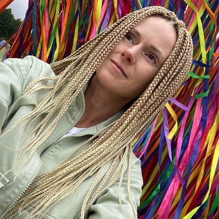

# Yuliya Lineitsava
***

>But do you know how old I will be by the time I learn to really play the piano / act / paint / write a decent play?
>Yes . . . the same age you will be if you don't.

__― Julia Cameron, The Artist's Way: A Spiritual Path to Higher Creativity__

## Personal information
Address: 35 A/1 40 let Pobedy Street, apt. 134, Borovlyany, 223053, Belarus  
Telephone: +375445567679  
Email: serata@mail.ru  
Date of birth: 21th August 1986  
Nationality: Russian  
Marital status: married with an 11-year-old daughter  

## Education
Minsk State Linguistic University, Interpreting and Translation Faculty, linguist and translator of Italian and English languages (2004–2009)

## Work experience
__T.E.L.S.-BY LLC, 2013–2022__  
freight forwarding and logistic services specialist
- organization cargo delivery via road from Italy to Russia/Belarus (including dangerous cargoes and those requiring particular conditions)
- assistance with cargo insurance and customs clearance
- development of relations with clients and transport companies. Search for new ones
- monitoring of invoices and receivables

__Production Private Unitary Enterprise "SoyuzInvestStroy", 2009–2013__  
foreign economic activities specialist
- business correspondence, phone calls to international clients and business partners
- search for new suppliers
- preparation of customs documents: invoices, packing lists, technical specifications etc.
- translation of technical literature, assembly instructions, scientific articles

## Personal qualities
- Interpersonal skills
- Teamwork skills
- Attention to detail
- Willingness to learn
- Ability to handle pressure and meet deadlines
- Flexibility

## Special skills

- Fluent English and Italian
- Driving License (Category B)
- Computer literacy (Microsoft Office, Outlook Express, 1C: Enterprise)
- Hobbies: sport, psychology

##  Web development basic knowledge
- HTML/CSS (Sass)/JS 
- Photoshop, Figma, Pixel Perfect
- Git, GitHub, Markdown